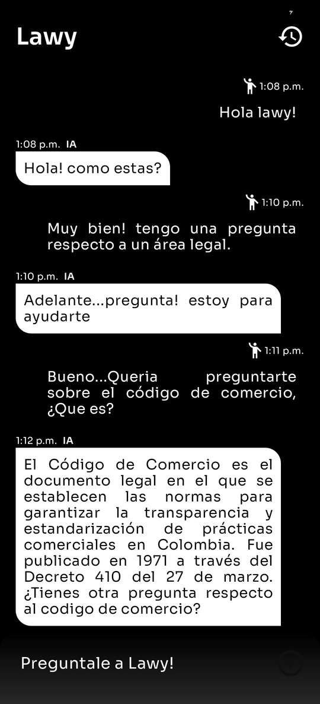

## Diseño de una aplicación móvil de orientación legal mediante IA generativa Transformer: Lawy IA

- ****Contexto:***  Las consultas de personas con relación a temas legales, son dispendiosas si no se dispone de una fuente unica y veraz, con la cual se pueda dar solución a la inquietud del solicitante.*

- ***Tecnologias:***
  - ****Kotlin 2.0.0***, para la creación de la app movil.*
  - ****Python*** necesario en el desarrollo de la IA generativa con TensorFlow, siendo esta una libreria orientada a la creación de redes neuronales. Con la cual se desarrollará un modelo de IA generativa autorregresiva, tipo transformer - Decoder only*
  - ****FireBase***, dentro de este servicio se utilizará un servicio de bases de datos no relacionales denominado, FireStore, el cual me permite guardar información dentro de un sistema de colecciones y documentos.*

- ****Área:*** Desarrollo de aplicaciones moviles en android, Desarrollo de IA* 

## Screenshots

## Features

- *Se implemento el patrón de arquitectonico MVVM (Model - View - ViewModel), el cual garantizo a este proyecto una excelente relación entre la interfaz grafica y el ViewModel. Siendo la UI desarrollada con el kit de herramientas Jetpack Compose.*

- *Para el diseño de esta app, con el fin de hacerla escalar y sostenible se implemento una ***Arquitectura de software*** tipo, Clean Architecture* 

## Authors

- [@Zheilon](https://www.github.com/Zheilon)

## Tech Stack

**Gestior de bases de datos:** FireBase

**Lenguage de codificación:** Kotlin 2.0.0

**UI:** Jetpack Compose